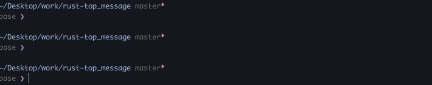

# rust-top_message
Display message on top (all written in Rust)

## Dependencies
- [Rust](https://www.rust-lang.org/tools/install) >= 1.62.0
    - rust-top_message requires Rust environment
    - [How should I install Rust ?](rust-how-to-install.md)

## Install rust-top_message
There are 2 ways to install.

### 1. Install by cargo
~~~
cargo install --git https://github.com/th2ch-g/rust-top_message.git
~~~
The executable file is in `~/.cargo/bin/rust-top_message`

### 2. Install from source
~~~
git clone https://github.com/th2ch-g/rust-top_message.git && \
cd ./rust-top_message && \
cargo build --release
~~~
The executable file is in `./target/release/rust-top_message`

## Subcommand
~~~
USAGE:
    rust-top_message <SUBCOMMAND>

OPTIONS:
    -h, --help       Print help information
    -V, --version    Print version information

SUBCOMMANDS:
    single       one message on one top
    multiple     one message on many top
    multiple2    many message on many top
    long         one long message on many top with newline
    vertical     message on many top vertically
    wave         one message on many top like electric bulletin board
    check        check if top_message can be executed normally
    help         Print this message or the help of the given subcommand(s)
~~~

## Quick start & Examples

### Single mode
~~~
$ rust-top_message single -m hello_world -@ 4 -t 20 & top
~~~

### Multiple mode
~~~
$ rust-top_message multiple -m hello_world -@ 4 -t 20 & top
~~~

### Multiple2 mode
~~~
$ rust-top_message multiple2 -m "hello_world1 hello_world2 hello_world3" -t 20 & top
~~~

### Long mode
~~~
$ rust-top_message long -m Rust_is_the_greatest_and_best_programming_language_ever -t 20 & top
~~~

### Vertical mode
~~~
$ rust-top_message vertical -m "ThankYou GoodLuck" -t 20 & top
~~~

### Wave mode
~~~
$ rust-top_message wave -m 123456789 -@ 4 & top
~~~

Check by yourself!

### Check mode

check if the directories created by rust-top_message remains in current directory
~~~
$ rust-top_message check --onlycheck

[CHECK] rustc seems to be installed
[CHECK] .tmp_20220731131724_487375867_68549 is seems to be directory created by rust-top_message
[CHECK] .tmp_20220731131730_903474437_68694 is seems to be directory created by rust-top_message
[CHECK] If you want to delete these directory, please execute --rmcheck option
~~~

check the directory created by rust-top_message && remove those directory
~~~
$ rust-top_message check --rmcheck

[CHECK] rustc seems to be installed
[CHECK] .tmp_20220731131724_487375867_68549 is seems to be directory created by rust-top_message
[CHECK] .tmp_20220731131730_903474437_68694 is seems to be directory created by rust-top_message
[REMOVED] All directories that rust-top_message may have created were successfully deleted
~~~

## Subcommand options

### Single mode

Option
~~~
USAGE:
    rust-top_message single [OPTIONS] --message <STR>

OPTIONS:
    -m, --message <STR>    message that appears on top
    -@, --thread <INT>     thread number [default: 1]
    -t, --time <INT>       display time(s) [default: 10]
        --tmpdir <STR>     tmp directory name [default: ./.tmp_(date_randomnumber_pid)]
    -h, --help             Print help information
    -V, --version          Print version information
~~~

### Multiple mode

Option
~~~
USAGE:
    rust-top_message multiple [OPTIONS] --message <STR>

OPTIONS:
    -m, --message <STR>    message that appears on top
    -@, --thread <INT>     thread number [default: 1]
    -t, --time <INT>       display time(s) [default: 10]
        --tmpdir <STR>     tmp directory name [default: ./.tmp_(date_randomnumber_pid)]
    -h, --help             Print help information
    -V, --version          Print version information
~~~

### Multiple2 mode

Option
~~~
USAGE:
    rust-top_message multiple2 [OPTIONS] --message <"STR STR STR ...">

OPTIONS:
    -m, --message <"STR STR STR ...">
            message that appears on top
            [CAUTION] If more than one messge, "" or '' is necessary
            [CAUTION] number of thread used is automatically determined

    -t, --time <INT>
            display time(s) [default: 10]

        --tmpdir <STR>
            tmp directory name [default: ./.tmp_(date_randomnumber_pid)]

    -h, --help
            Print help information

    -V, --version
            Print version information
~~~

### Long mode

Option
~~~
USAGE:
    rust-top_message long [OPTIONS] --message <STR>

OPTIONS:
    -m, --message <STR>    one long message that appears on top
                           [CAUTION] number of thread used is automatically determined
    -t, --time <INT>       display time(s) [default: 10]
    -l, --length <INT>     characters per top [default: 12]
        --tmpdir <STR>     tmp directory name [default: ./.tmp_(date_randomnumber_pid)]
    -h, --help             Print help information
    -V, --version          Print version information
~~~

### Vertical mode

Option
~~~
USAGE:
    rust-top_message vertical [OPTIONS] --message <"STR STR STR ...">

OPTIONS:
    -m, --message <"STR STR STR ...">
            message that appears on top
            [CAUTION] If more than one messge, "" or '' is necessary
            [CAUTION] number of thread used is automatically determined

    -t, --time <INT>
            display time(s) [default: 10]

        --tmpdir <STR>
            tmp directory name [default: ./.tmp_(date_randomnumber_pid)]

    -h, --help
            Print help information

    -V, --version
            Print version information
~~~

### Wave mode

Option
~~~
USAGE:
    rust-top_message wave [OPTIONS] --message <STR>

OPTIONS:
    -m, --message <STR>    one message on one top like electric bulletin board
                           [CAUTION] number of thread used is automatically determined
    -@, --thread <INT>     thread numer [default: 1]
    -l, --length <INT>     characters per top [default: 12]
        --tmpdir <STR>     tmp directory name [default: ./.tmp_(date_randomnumber_pid)]
    -h, --help             Print help information
    -V, --version          Print version information
~~~

### Check mode

Option
~~~
USAGE:
    rust-top_message check [OPTIONS]

OPTIONS:
        --onlycheck        check that top_message can be executed normally & tmp directory that
                           top_message created
        --onlyrustcheck    check that top_message can be executed normally
        --onlydircheck     check tmp directory that top_message created
        --rmcheck          check that top_message can be executed normally &
                           REMOVE tmp dirctory that top_message created
    -h, --help             Print help information
    -V, --version          Print version information
~~~

## Recommend alias

Since rust-top_message is a long program name, it is recommended to register alias on your ~/.zshrc and so on.

~~~
alias rtm="[Your_rust-top_message_realpath]"
~~~

