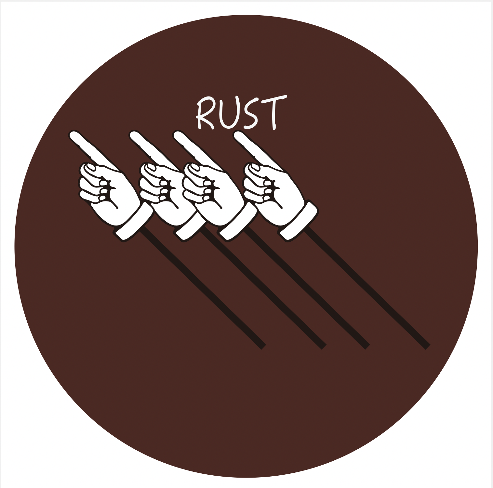
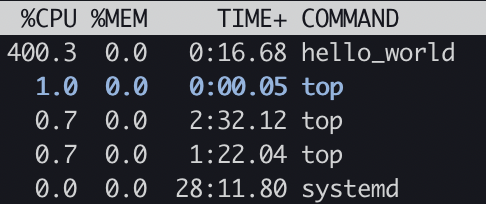
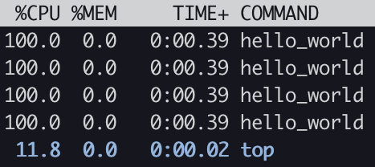
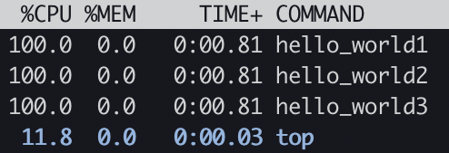
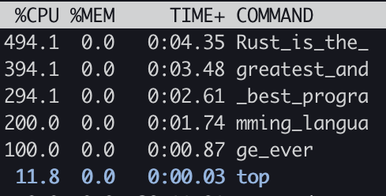
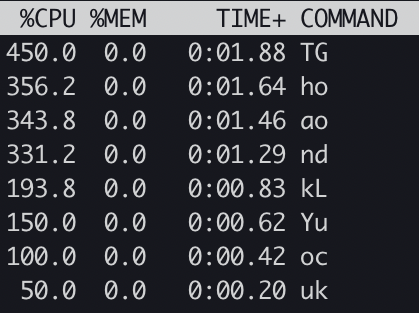

  
  <h2 align="center"> rust-top_message </h2>
  
✨✨ Display message on top 😱😭

  
  
  
  
  
  
  

# rust-top_message

- [rust-top\_message](#rust-top_message)
  - [Install](#install)
    - [Dependencies](#dependencies)
  - [Install OpenMPI version](#install-openmpi-version)
    - [Dependencies](#dependencies-1)
  - [Gallery](#gallery)
  - [Quick start \& Examples](#quick-start--examples)
    - [Single mode](#single-mode)
    - [Multiple mode](#multiple-mode)
    - [Multiple2 mode](#multiple2-mode)
    - [Long mode](#long-mode)
    - [Vertical mode](#vertical-mode)
    - [Wave mode](#wave-mode)
    - [Check mode](#check-mode)

## Install
~~~
cargo install --git https://github.com/th2ch-g/rust-top_message.git
~~~

### Dependencies
- [Rust](https://www.rust-lang.org/tools/install) (tested rustc 1.71.0, cargo 1.71.0)
    - rust-top_message requires Rust environment

## Install OpenMPI version
~~~
cd rtm-mpi
cargo build -r
# The binary named rtm_mpi will be created at ./target/release/rtm_mpi
~~~

### Dependencies
- openmpi

## Gallery
<a href=#single>
    </img>
</a>

<a href=#multiple>
    </img>
</a>

<a href=#multiple2>
    </img>
</a>

<a href=#long>
    </img>
</a>

<a href=#vertical>
    </img>
</a>

## Quick start & Examples

### Single mode
~~~
rtm single -m hello_world -@ 4 -t 20 & top
~~~

### Multiple mode
~~~
rtm multiple -m hello_world -@ 4 -t 20 & top
~~~

### Multiple2 mode
~~~
rtm multiple2 -m "hello_world1 hello_world2 hello_world3" -t 20 & top
~~~

### Long mode
~~~
rtm long -m Rust_is_the_greatest_and_best_programming_language_ever -t 20 & top
~~~

### Vertical mode
~~~
rtm vertical -m "ThankYou GoodLuck" -t 20 & top
~~~

### Wave mode
~~~
rtm wave -m 123456789 -@ 4 & top
~~~

### Check mode
- check if the directories created by rust-top_message remains in current directory
~~~
$ rtm check --onlycheck
[CHECK] rustc seems to be installed
[CHECK] .tmp_20220731131724_487375867_68549 is seems to be directory created by rtm-lib
[CHECK] .tmp_20220731131730_903474437_68694 is seems to be directory created by rtm-lib
[CHECK] If you want to delete these directory, please execute --rmcheck option
~~~

- check the directory created by rust-top_message && remove those directory
~~~
$ rtm check --rmcheck
[CHECK] rustc seems to be installed
[CHECK] .tmp_20220731131724_487375867_68549 is seems to be directory created by rtm-lib
[CHECK] .tmp_20220731131730_903474437_68694 is seems to be directory created by rtm-lib
[REMOVED] All directories that rtm-lib may have created were successfully deleted
~~~

